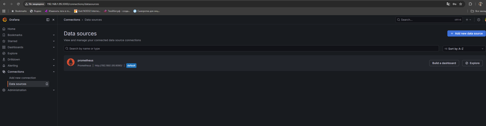
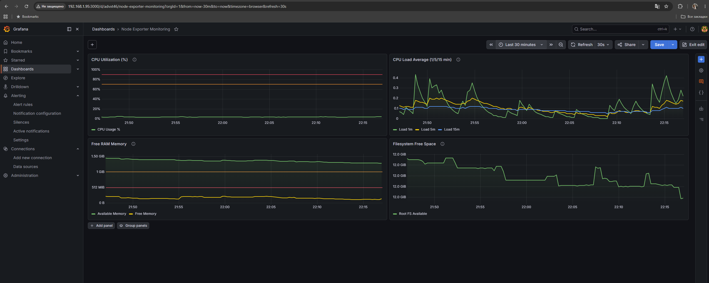
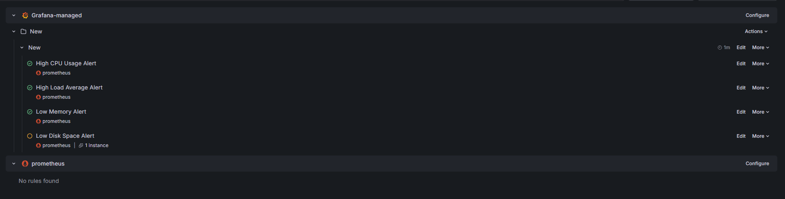

## Задание 1

<p align="center">
  
  <br>
</p>

## Задание 2

#### 1. Утилизация CPU (в процентах, 100-idle)
100 - (avg by (instance) (rate(node_cpu_seconds_total{mode="idle"}[5m])) * 100)

#### 2. CPU Load Average (1/5/15 минут)
node_load1
node_load5
node_load15

#### 3. Количество свободной оперативной памяти
node_memory_MemFree_bytes

#### 4. Количество места на файловой системе (в процентах)
(node_filesystem_avail_bytes{mountpoint="/etc/hostname"} / node_filesystem_size_bytes{mountpoint="/etc/hostname"}) * 100

<p align="center">
  
  <br>

</p>


## Задание 3

<p align="center">
  
  <br>

</p>
 Сводная таблица алертов Node Exporter Monitoring <br>
<p></p>

| # | Alert Name | Query | Condition | For | Severity |
|---|------------|-------|-----------|-----|----------|
| 1 | High CPU Usage Alert | `100 - (avg by (instance) (rate(node_cpu_seconds_total{mode="idle"}[5m])) * 100)` | > 90 | 5m | Warning |
| 2 | High Load Average Alert | `node_load1` | > 4 | 5m | Warning |
| 3 | Low Memory Alert | `node_memory_MemFree_bytes` | < 536870912 (512 MB) | 2m | Critical |
| 4 | Low Disk Space Alert | `(node_filesystem_avail_bytes{mountpoint="/etc/hostname"} / node_filesystem_size_bytes{mountpoint="/etc/hostname"}) * 100` | < 10% | 5m | Warning |

- Alert 1: High CPU Usage   <br>
100 - (avg by (instance) (rate(node_cpu_seconds_total{mode="idle"}[5m])) * 100) > 90

- Alert 2: High Load Average   <br>
node_load1 > 4

- Alert 3: Low Memory   <br>
node_memory_MemFree_bytes < 536870912

- Alert 4: Low Disk Space   <br>
(node_filesystem_avail_bytes{mountpoint="/etc/hostname"} / node_filesystem_size_bytes{mountpoint="/etc/hostname"}) * 100 < 10

## Задание 4

```bash
{
  "apiVersion": "dashboard.grafana.app/v2",
  "kind": "Dashboard",
  "metadata": {
    "name": "advxt46",
    "namespace": "default",
    "uid": "ce0e8c5d-e884-48f4-b5be-e98abe26c170",
    "resourceVersion": "1779478954286997",
    "generation": 6,
    "creationTimestamp": "2026-05-22T18:30:18Z",
    "labels": {
      "grafana.app/deprecatedInternalID": "4250390168944640"
    },
    "annotations": {
      "grafana.app/createdBy": "user:dfmulwmjpsi68e",
      "grafana.app/folder": "",
      "grafana.app/saved-from-ui": "Grafana v13.0.1+security-01 (9bbe672d)",
      "grafana.app/updatedBy": "user:dfmulwmjpsi68e",
      "grafana.app/updatedTimestamp": "2026-05-22T19:42:34Z"
    }
  },
  "spec": {
    "annotations": [
      {
        "kind": "AnnotationQuery",
        "spec": {
          "query": {
            "kind": "DataQuery",
            "group": "grafana",
            "version": "v0",
            "datasource": {
              "name": "-- Grafana --"
            },
            "spec": {}
          },
          "enable": true,
          "hide": true,
          "iconColor": "rgba(0, 211, 255, 1)",
          "name": "Annotations & Alerts",
          "builtIn": true
        }
      }
    ],
    "cursorSync": "Off",
    "description": "Node Exporter Monitoring Dashboard",
    "editable": true,
    "elements": {
      "panel-1": {
        "kind": "Panel",
        "spec": {
          "id": 1,
          "title": "CPU Utilization (%)",
          "description": "CPU utilization in percent (100% - idle time)",
          "links": [],
          "data": {
            "kind": "QueryGroup",
            "spec": {
              "queries": [
                {
                  "kind": "PanelQuery",
                  "spec": {
                    "query": {
                      "kind": "DataQuery",
                      "group": "prometheus",
                      "version": "v0",
                      "datasource": {
                        "name": "prometheus"
                      },
                      "spec": {
                        "editorMode": "code",
                        "expr": "100 - (avg(rate(node_cpu_seconds_total{mode=\"idle\"}[1m])) * 100)",
                        "legendFormat": "CPU Usage %",
                        "range": true
                      }
                    },
                    "refId": "A",
                    "hidden": false
                  }
                }
              ],
              "transformations": [],
              "queryOptions": {}
            }
          },
          "vizConfig": {
            "kind": "VizConfig",
            "group": "timeseries",
            "version": "13.0.1+security-01",
            "spec": {
              "options": {
                "annotations": {
                  "clustering": -1,
                  "multiLane": false
                },
                "legend": {
                  "calcs": [],
                  "displayMode": "list",
                  "placement": "bottom",
                  "showLegend": true
                },
                "tooltip": {
                  "hideZeros": false,
                  "mode": "single",
                  "sort": "none"
                }
              },
              "fieldConfig": {
                "defaults": {
                  "unit": "percent",
                  "min": 0,
                  "max": 100,
                  "thresholds": {
                    "mode": "absolute",
                    "steps": [
                      {
                        "value": 0,
                        "color": "green"
                      },
                      {
                        "value": 70,
                        "color": "orange"
                      },
                      {
                        "value": 90,
                        "color": "red"
                      }
                    ]
                  },
                  "color": {
                    "mode": "palette-classic"
                  },
                  "custom": {
                    "axisBorderShow": false,
                    "axisCenteredZero": false,
                    "axisColorMode": "text",
                    "axisLabel": "",
                    "axisPlacement": "auto",
                    "barAlignment": 0,
                    "barWidthFactor": 0.6,
                    "drawStyle": "line",
                    "fillOpacity": 10,
                    "gradientMode": "opacity",
                    "hideFrom": {
                      "legend": false,
                      "tooltip": false,
                      "viz": false
                    },
                    "insertNulls": false,
                    "lineInterpolation": "linear",
                    "lineWidth": 2,
                    "pointSize": 5,
                    "scaleDistribution": {
                      "type": "linear"
                    },
                    "showPoints": "auto",
                    "showValues": false,
                    "spanNulls": false,
                    "stacking": {
                      "group": "A",
                      "mode": "none"
                    },
                    "thresholdsStyle": {
                      "mode": "line"
                    }
                  }
                },
                "overrides": []
              }
            }
          }
        }
      },
      "panel-2": {
        "kind": "Panel",
        "spec": {
          "id": 2,
          "title": "CPU Load Average (1/5/15 min)",
          "description": "System load average for 1, 5, and 15 minutes",
          "links": [],
          "data": {
            "kind": "QueryGroup",
            "spec": {
              "queries": [
                {
                  "kind": "PanelQuery",
                  "spec": {
                    "query": {
                      "kind": "DataQuery",
                      "group": "prometheus",
                      "version": "v0",
                      "datasource": {
                        "name": "efmum3zd99blsc"
                      },
                      "spec": {
                        "editorMode": "code",
                        "expr": "node_load1",
                        "legendFormat": "Load 1m",
                        "range": true
                      }
                    },
                    "refId": "A",
                    "hidden": false
                  }
                },
                {
                  "kind": "PanelQuery",
                  "spec": {
                    "query": {
                      "kind": "DataQuery",
                      "group": "prometheus",
                      "version": "v0",
                      "datasource": {
                        "name": "efmum3zd99blsc"
                      },
                      "spec": {
                        "editorMode": "code",
                        "expr": "node_load5",
                        "legendFormat": "Load 5m",
                        "range": true
                      }
                    },
                    "refId": "B",
                    "hidden": false
                  }
                },
                {
                  "kind": "PanelQuery",
                  "spec": {
                    "query": {
                      "kind": "DataQuery",
                      "group": "prometheus",
                      "version": "v0",
                      "datasource": {
                        "name": "efmum3zd99blsc"
                      },
                      "spec": {
                        "editorMode": "code",
                        "expr": "node_load15",
                        "legendFormat": "Load 15m",
                        "range": true
                      }
                    },
                    "refId": "C",
                    "hidden": false
                  }
                }
              ],
              "transformations": [],
              "queryOptions": {}
            }
          },
          "vizConfig": {
            "kind": "VizConfig",
            "group": "timeseries",
            "version": "13.0.1+security-01",
            "spec": {
              "options": {
                "annotations": {
                  "clustering": -1,
                  "multiLane": false
                },
                "legend": {
                  "calcs": [],
                  "displayMode": "list",
                  "placement": "bottom",
                  "showLegend": true
                },
                "tooltip": {
                  "hideZeros": false,
                  "mode": "single",
                  "sort": "none"
                }
              },
              "fieldConfig": {
                "defaults": {
                  "unit": "none",
                  "thresholds": {
                    "mode": "absolute",
                    "steps": [
                      {
                        "value": 0,
                        "color": "green"
                      },
                      {
                        "value": 2,
                        "color": "orange"
                      },
                      {
                        "value": 4,
                        "color": "red"
                      }
                    ]
                  },
                  "color": {
                    "mode": "palette-classic"
                  },
                  "custom": {
                    "axisBorderShow": false,
                    "axisCenteredZero": false,
                    "axisColorMode": "text",
                    "axisLabel": "",
                    "axisPlacement": "auto",
                    "barAlignment": 0,
                    "barWidthFactor": 0.6,
                    "drawStyle": "line",
                    "fillOpacity": 10,
                    "gradientMode": "opacity",
                    "hideFrom": {
                      "legend": false,
                      "tooltip": false,
                      "viz": false
                    },
                    "insertNulls": false,
                    "lineInterpolation": "linear",
                    "lineWidth": 2,
                    "pointSize": 5,
                    "scaleDistribution": {
                      "type": "linear"
                    },
                    "showPoints": "auto",
                    "showValues": false,
                    "spanNulls": false,
                    "stacking": {
                      "group": "A",
                      "mode": "none"
                    },
                    "thresholdsStyle": {
                      "mode": "line"
                    }
                  }
                },
                "overrides": []
              }
            }
          }
        }
      },
      "panel-3": {
        "kind": "Panel",
        "spec": {
          "id": 3,
          "title": "Free RAM Memory",
          "description": "Free RAM memory including buffers and cache",
          "links": [],
          "data": {
            "kind": "QueryGroup",
            "spec": {
              "queries": [
                {
                  "kind": "PanelQuery",
                  "spec": {
                    "query": {
                      "kind": "DataQuery",
                      "group": "prometheus",
                      "version": "v0",
                      "datasource": {
                        "name": "prometheus"
                      },
                      "spec": {
                        "editorMode": "code",
                        "expr": "node_memory_MemFree_bytes + node_memory_Buffers_bytes + node_memory_Cached_bytes",
                        "legendFormat": "Available Memory",
                        "range": true
                      }
                    },
                    "refId": "A",
                    "hidden": false
                  }
                },
                {
                  "kind": "PanelQuery",
                  "spec": {
                    "query": {
                      "kind": "DataQuery",
                      "group": "prometheus",
                      "version": "v0",
                      "datasource": {
                        "name": "prometheus"
                      },
                      "spec": {
                        "editorMode": "code",
                        "expr": "node_memory_MemFree_bytes",
                        "legendFormat": "Free Memory",
                        "range": true
                      }
                    },
                    "refId": "B",
                    "hidden": false
                  }
                }
              ],
              "transformations": [],
              "queryOptions": {}
            }
          },
          "vizConfig": {
            "kind": "VizConfig",
            "group": "timeseries",
            "version": "13.0.1+security-01",
            "spec": {
              "options": {
                "annotations": {
                  "clustering": -1,
                  "multiLane": false
                },
                "legend": {
                  "calcs": [],
                  "displayMode": "list",
                  "placement": "bottom",
                  "showLegend": true
                },
                "tooltip": {
                  "hideZeros": false,
                  "mode": "single",
                  "sort": "none"
                }
              },
              "fieldConfig": {
                "defaults": {
                  "unit": "bytes",
                  "thresholds": {
                    "mode": "absolute",
                    "steps": [
                      {
                        "value": 0,
                        "color": "green"
                      },
                      {
                        "value": 1073741824,
                        "color": "orange"
                      },
                      {
                        "value": 524288000,
                        "color": "red"
                      }
                    ]
                  },
                  "color": {
                    "mode": "palette-classic"
                  },
                  "custom": {
                    "axisBorderShow": false,
                    "axisCenteredZero": false,
                    "axisColorMode": "text",
                    "axisLabel": "",
                    "axisPlacement": "auto",
                    "barAlignment": 0,
                    "barWidthFactor": 0.6,
                    "drawStyle": "line",
                    "fillOpacity": 10,
                    "gradientMode": "opacity",
                    "hideFrom": {
                      "legend": false,
                      "tooltip": false,
                      "viz": false
                    },
                    "insertNulls": false,
                    "lineInterpolation": "linear",
                    "lineWidth": 2,
                    "pointSize": 5,
                    "scaleDistribution": {
                      "type": "linear"
                    },
                    "showPoints": "auto",
                    "showValues": false,
                    "spanNulls": false,
                    "stacking": {
                      "group": "A",
                      "mode": "none"
                    },
                    "thresholdsStyle": {
                      "mode": "line"
                    }
                  }
                },
                "overrides": []
              }
            }
          }
        }
      },
      "panel-4": {
        "kind": "Panel",
        "spec": {
          "id": 4,
          "title": "Filesystem Free Space",
          "description": "Free disk space on root filesystem",
          "links": [],
          "data": {
            "kind": "QueryGroup",
            "spec": {
              "queries": [
                {
                  "kind": "PanelQuery",
                  "spec": {
                    "query": {
                      "kind": "DataQuery",
                      "group": "prometheus",
                      "version": "v0",
                      "datasource": {
                        "name": "prometheus"
                      },
                      "spec": {
                        "editorMode": "code",
                        "expr": "node_filesystem_avail_bytes{fstype=~\"ext4|xfs|btrfs\", mountpoint=\"/\"}",
                        "legendFormat": "Root FS Available",
                        "range": true
                      }
                    },
                    "refId": "A",
                    "hidden": false
                  }
                }
              ],
              "transformations": [],
              "queryOptions": {}
            }
          },
          "vizConfig": {
            "kind": "VizConfig",
            "group": "timeseries",
            "version": "13.0.1+security-01",
            "spec": {
              "options": {
                "annotations": {
                  "clustering": -1,
                  "multiLane": false
                },
                "legend": {
                  "calcs": [],
                  "displayMode": "list",
                  "placement": "bottom",
                  "showLegend": true
                },
                "tooltip": {
                  "hideZeros": false,
                  "mode": "single",
                  "sort": "none"
                }
              },
              "fieldConfig": {
                "defaults": {
                  "unit": "bytes",
                  "thresholds": {
                    "mode": "absolute",
                    "steps": [
                      {
                        "value": 0,
                        "color": "green"
                      },
                      {
                        "value": 10737418240,
                        "color": "orange"
                      },
                      {
                        "value": 5368709120,
                        "color": "red"
                      }
                    ]
                  },
                  "color": {
                    "mode": "palette-classic"
                  },
                  "custom": {
                    "axisBorderShow": false,
                    "axisCenteredZero": false,
                    "axisColorMode": "text",
                    "axisLabel": "",
                    "axisPlacement": "auto",
                    "barAlignment": 0,
                    "barWidthFactor": 0.6,
                    "drawStyle": "line",
                    "fillOpacity": 10,
                    "gradientMode": "opacity",
                    "hideFrom": {
                      "legend": false,
                      "tooltip": false,
                      "viz": false
                    },
                    "insertNulls": false,
                    "lineInterpolation": "linear",
                    "lineWidth": 2,
                    "pointSize": 5,
                    "scaleDistribution": {
                      "type": "linear"
                    },
                    "showPoints": "auto",
                    "showValues": false,
                    "spanNulls": false,
                    "stacking": {
                      "group": "A",
                      "mode": "none"
                    },
                    "thresholdsStyle": {
                      "mode": "line"
                    }
                  }
                },
                "overrides": []
              }
            }
          }
        }
      }
    },
    "layout": {
      "kind": "GridLayout",
      "spec": {
        "items": [
          {
            "kind": "GridLayoutItem",
            "spec": {
              "x": 0,
              "y": 0,
              "width": 12,
              "height": 8,
              "element": {
                "kind": "ElementReference",
                "name": "panel-1"
              }
            }
          },
          {
            "kind": "GridLayoutItem",
            "spec": {
              "x": 12,
              "y": 0,
              "width": 12,
              "height": 8,
              "element": {
                "kind": "ElementReference",
                "name": "panel-2"
              }
            }
          },
          {
            "kind": "GridLayoutItem",
            "spec": {
              "x": 0,
              "y": 8,
              "width": 12,
              "height": 8,
              "element": {
                "kind": "ElementReference",
                "name": "panel-3"
              }
            }
          },
          {
            "kind": "GridLayoutItem",
            "spec": {
              "x": 12,
              "y": 8,
              "width": 12,
              "height": 8,
              "element": {
                "kind": "ElementReference",
                "name": "panel-4"
              }
            }
          }
        ]
      }
    },
    "links": [],
    "liveNow": false,
    "preload": false,
    "tags": [
      "node-exporter",
      "system",
      "monitoring"
    ],
    "timeSettings": {
      "timezone": "browser",
      "from": "now-6h",
      "to": "now",
      "autoRefresh": "",
      "autoRefreshIntervals": [
        "5s",
        "10s",
        "30s",
        "1m",
        "5m",
        "15m",
        "30m",
        "1h",
        "2h",
        "1d"
      ],
      "hideTimepicker": false,
      "fiscalYearStartMonth": 0
    },
    "title": "Node Exporter Monitoring",
    "variables": [],
    "preferences": {
      "layout": {
        "kind": "GridLayout",
        "spec": {
          "items": []
        }
      }
    }
  }
}
```
